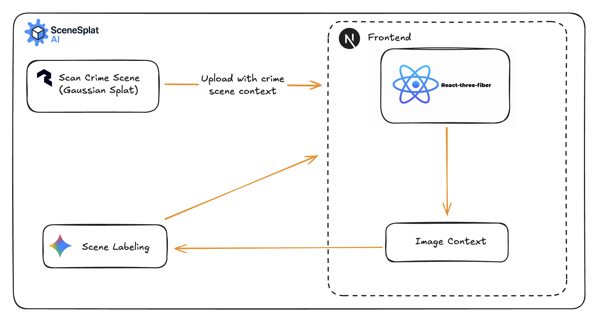

## SceneSplat - 3D Scene Evidence Analyzer

An interactive app that lets investigators explore 3D scene reconstructions and automatically detect points of interest using AI. Users can load scenes, analyze them for evidence, view markers in 3D, and take notes per case.

### Team

- Bekbol
- Amir
- Ibrahim
- Atai

### Event

SBU Hacks 2025

### What it does

- **3D viewing**: Renders `.glb` models in the browser with orbit/zoom/pan controls.
- **AI evidence detection**: Finds objects/anomalies/evidence and returns labeled markers with confidence scores.
- **Two analysis modes**:
  - Quick analysis using model data (GLB metadata/structure)
  - Vision analysis by sending a screenshot of the current 3D view to Gemini
- **Case management**: Parent/child scenes, details panel, and notes per scene.
- **Uploads**: Add new GLB or supporting files per scene.

### Tech stack

- **Frontend**: Next.js App Router, React 19, TailwindCSS, Radix UI
- **3D**: React Three Fiber, drei, three.js
- **AI**: Google Gemini (`@google/generative-ai`)
- **Runtime**: Node 20+

### System diagram

